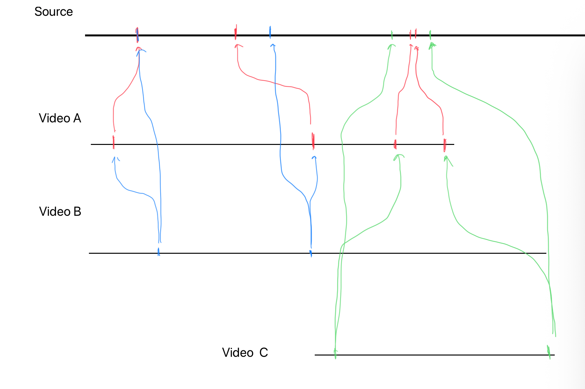
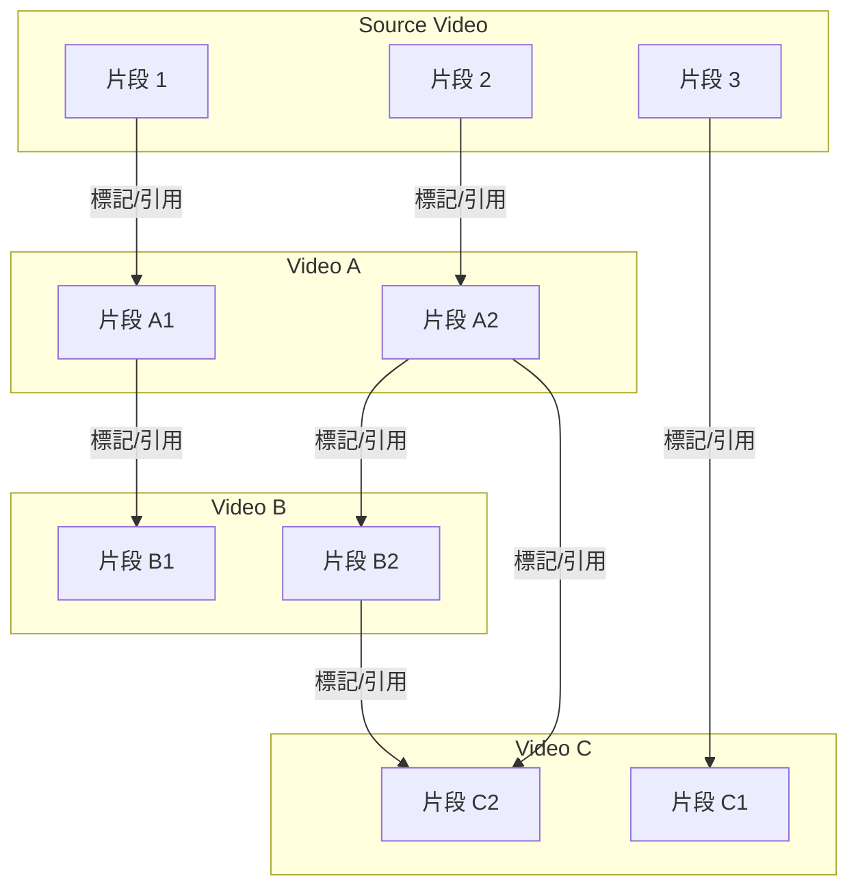

# ariadne
In a labyrinth of misinformation and decontextualized video clips, Ariadne provides the thread to find your way back to the source. This browser extension allows users to mark and discover relationships between videos, fighting malicious editing by revealing the original context.

## Quick Start

### Quick Setup

1. **Setup environment:**
   ```bash
   # Complete setup (install dependencies + database)
   make setup
   ```

2. **Start services:**
   ```bash
   # Start all services (PostgreSQL, PgAdmin)
   make docker-up
   
   # Start backend server
   make backend-run
   ```

### Alternative: Step by Step

1. **Install dependencies:**
   ```bash
   make install
   ```

2. **Setup database:**
   ```bash
   make db-setup
   ```

3. **Start services:**
   ```bash
   make docker-up
   make backend-run
   ```

### Database Management

- **Run migrations:** `make db-migrate`
- **Revert migration:** `make db-rollback`
- **Check status:** `make db-status`
- **Reset database:** `make db-reset` (⚠️ dangerous!)
- **Start services:** `make docker-up`
- **Stop services:** `make docker-down`
- **View logs:** `make docker-logs`

### Database Access

- **PgAdmin (Web UI):** http://localhost:8080
  - Email: `admin@ariadne.local`
  - Password: `admin`

### Available Commands

Run `make help` to see all available commands:
- **Project management:** `make install`, `make setup`, `make build`
- **Database:** `make db-setup`, `make db-migrate`, `make db-status`
- **Infrastructure:** `make docker-up`, `make docker-down`
- **Development:** `make backend-run`, `make backend-test`

## Architecture

### Directory Structure
```
.
├── backend/             # 後端程式碼
│ ├── src/
│ │ ├── config/         # 配置管理
│ │ ├── domain/         # 領域層（資料模型、實體）
│ │ ├── delivery/       # 交付層（路由、中間件）
│ │ ├── services/       # 服務層（業務邏輯）
│ │ ├── repositories/   # 資料存取層
│ │ ├── traits/         # 介面定義
│ │ ├── database/       # 資料庫配置
│ │ ├── state.rs        # 應用狀態
│ │ └── main.rs         # 應用入口
│ └── Dockerfile
├── frontend/           # 前端程式碼（待建立）
├── database/           # 資料庫遷移檔案
├── infrastructure/     # 基礎設施配置
├── Makefile            # 統一的管理命令
├── README.md
└── TODO.md
```

## 影片片段關聯設計示意



> 若下方 Mermaid 圖無法顯示，請參考上方靜態圖片。



> **說明：**
> - 每一條橫線代表一部影片的 timeline（Source、Video A、Video B、Video C）。
> - 每個節點（S1、A1、B1...）代表該影片的一個片段（可對應到實際的時間區間）。
> - 箭頭代表「片段之間的引用或標記關聯」。
> - 每一條關聯都是一對一（來源片段 → 目標片段），不允許一條關聯同時指向多個來源或多個目標。
> - 這種設計方便追蹤片段的來源、流向，並支援群眾外包標記、審核、聚合等功能。