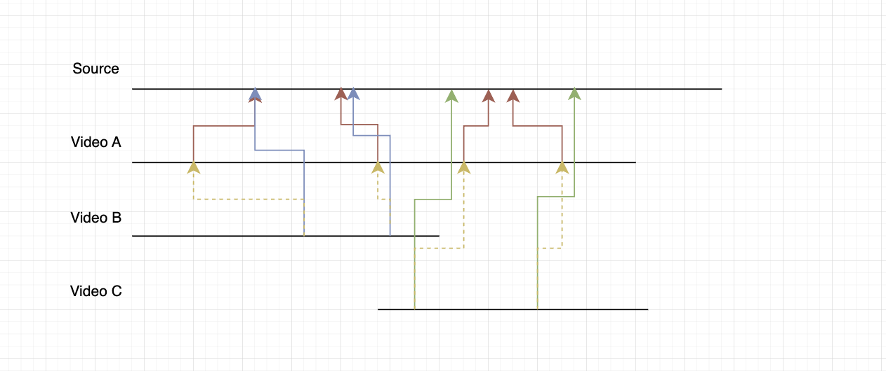
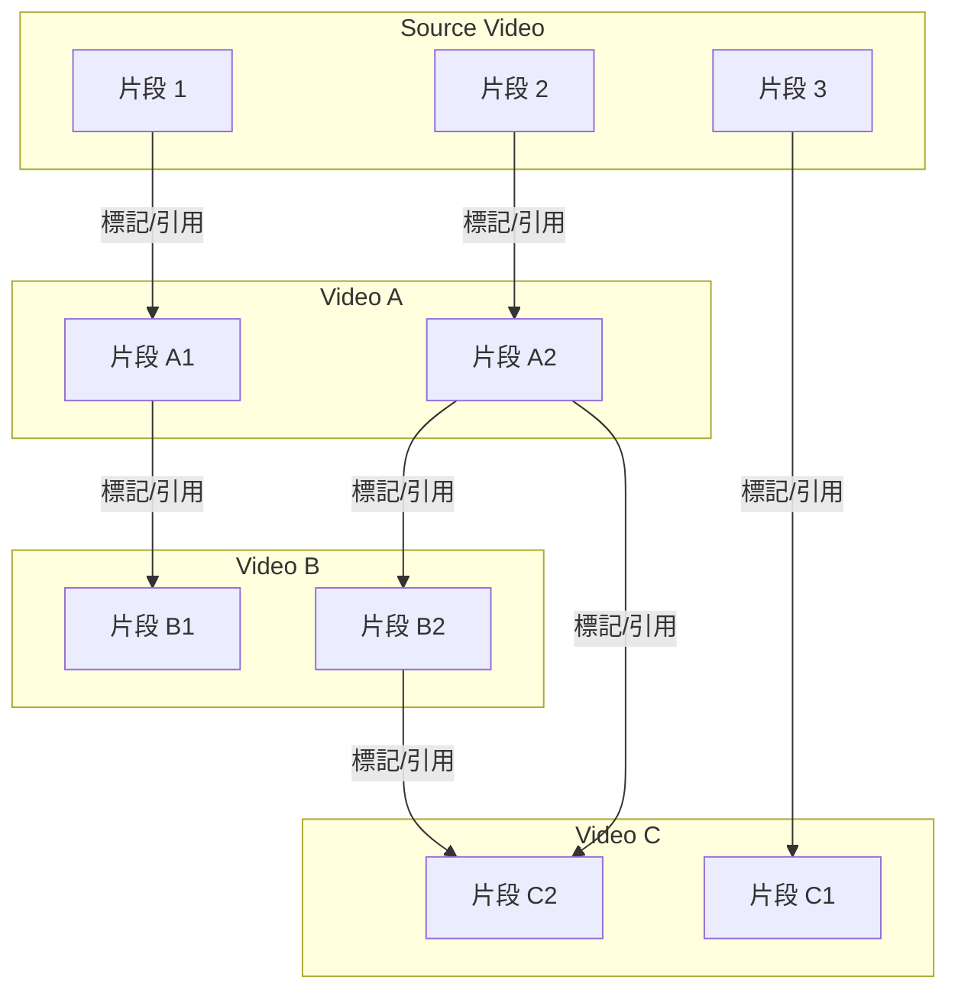

# ariadne
In a labyrinth of misinformation and decontextualized video clips, Ariadne provides the thread to find your way back to the source. This browser extension allows users to mark and discover relationships between videos, fighting malicious editing by revealing the original context.

## Quick Start

### Quick Setup

1. **Setup environment:**
   ```bash
   # Complete setup (install dependencies + database)
   make setup
   ```

2. **Start services:**
   ```bash
   # Start all services (PostgreSQL, PgAdmin)
   make docker-up
   
   # Start backend server
   make backend-run
   
   # Start frontend development server
   make frontend-dev
   ```

### Alternative: Step by Step

1. **Install dependencies:**
   ```bash
   make install
   ```

2. **Setup database:**
   ```bash
   make db-setup
   ```

3. **Start services:**
   ```bash
   make docker-up
   make backend-run
   make frontend-dev
   ```

### Database Management

- **Run migrations:** `make db-migrate`
- **Revert migration:** `make db-rollback`
- **Check status:** `make db-status`
- **Reset database:** `make db-reset` (⚠️ dangerous!)
- **Start services:** `make docker-up`
- **Stop services:** `make docker-down`
- **View logs:** `make docker-logs`

### Database Access

- **PgAdmin (Web UI):** http://localhost:8080
  - Email: `admin@ariadne.local`
  - Password: `admin`

### Available Commands

Run `make help` to see all available commands:
- **Project management:** `make install`, `make setup`, `make build`
- **Database:** `make db-setup`, `make db-migrate`, `make db-status`
- **Infrastructure:** `make docker-up`, `make docker-down`
- **Development:** `make backend-run`, `make backend-test`, `make frontend-dev`

## Architecture

### Directory Structure
```
.
├── backend/             # 後端程式碼 (Rust + Axum)
│ ├── src/
│ │ ├── config/         # 配置管理
│ │ ├── domain/         # 領域層（資料模型、實體）
│ │ ├── delivery/       # 交付層（路由、中間件）
│ │ ├── services/       # 服務層（業務邏輯）
│ │ ├── repositories/   # 資料存取層
│ │ ├── traits/         # 介面定義
│ │ ├── database/       # 資料庫配置
│ │ ├── state.rs        # 應用狀態
│ │ └── main.rs         # 應用入口
│ └── Dockerfile
├── frontend/           # 前端程式碼 (React + TypeScript + Vite)
│ ├── src/
│ │ ├── components/     # React 組件
│ │ ├── pages/          # 頁面組件
│ │ ├── hooks/          # 自定義 Hooks
│ │ ├── services/       # API 服務
│ │ ├── types/          # TypeScript 類型定義
│ │ ├── utils/          # 工具函數
│ │ └── styles/         # 樣式檔案
│ ├── public/           # 靜態資源
│ ├── manifest.json     # Chrome Extension 清單
│ ├── tailwind.config.js # Tailwind CSS 配置
│ └── package.json
├── database/           # 資料庫遷移檔案
├── infrastructure/     # 基礎設施配置
├── Makefile            # 統一的管理命令
├── README.md
└── TODO.md
```

## Chrome Extension Development

### 技術棧
- **前端框架:** React 19 + TypeScript
- **建置工具:** Vite + Bun
- **樣式框架:** Tailwind CSS
- **狀態管理:** Zustand (推薦) 或 Redux Toolkit
- **HTTP 客戶端:** Axios
- **路由管理:** React Router DOM
- **UI 組件:** Headless UI + Heroicons

### 開發環境設置

1. **安裝 Bun (JavaScript Runtime):**
   ```bash
   curl -fsSL https://bun.sh/install | bash
   ```

2. **建立 Vite + React + TypeScript 專案:**
   ```bash
   bun create vite@latest frontend -- --template react-ts
   cd frontend
   bun install
   ```

3. **安裝必要依賴:**
   ```bash
   bun add axios react-router-dom @headlessui/react @heroicons/react
   bun add -d tailwindcss postcss autoprefixer sass
   ```

4. **初始化 Tailwind CSS:**
   ```bash
   bunx tailwindcss init -p
   ```

### Chrome Extension 結構

```
frontend/
├── manifest.json           # Chrome Extension 清單檔案
├── src/
│   ├── popup/             # 彈出視窗組件
│   │   ├── Popup.tsx
│   │   └── popup.css
│   ├── content/           # 內容腳本組件
│   │   ├── ContentScript.tsx
│   │   └── content.css
│   ├── background/        # 背景腳本
│   │   └── background.ts
│   ├── components/        # 共用組件
│   │   ├── Button.tsx
│   │   ├── TimeSelector.tsx
│   │   └── RelationForm.tsx
│   └── services/          # API 服務
│       └── api.ts
├── public/
│   ├── icons/            # 圖示檔案
│   │   ├── icon16.png
│   │   ├── icon48.png
│   │   └── icon128.png
│   └── manifest.json     # 開發用清單檔案
└── dist/                 # 建置輸出
```

### 核心功能組件

1. **Content Script (內容腳本)**
   - YouTube 頁面偵測
   - 影片資訊解析
   - UI 元件注入
   - 時間軸讀取

2. **Popup (彈出視窗)**
   - 設定管理
   - 統計資訊
   - 快速操作

3. **Background Script (背景腳本)**
   - 狀態管理
   - API 呼叫
   - 通知處理

### 開發指令

```bash
# 開發模式
bun run dev

# 建置生產版本
bun run build

# 預覽生產版本
bun run preview

# 執行測試
bun run test

# 建置 Chrome Extension
bun run build:extension
```

## Chrome Web Store 送審指南

### 準備階段

1. **確保符合政策**
   - 遵守 [Chrome Web Store 政策](https://developer.chrome.com/docs/webstore/program_policies/)
   - 測試所有功能正常運作
   - 準備詳細的功能說明

2. **必要檔案清單**
   ```
   extension/
   ├── manifest.json          # 插件清單檔案
   ├── popup.html            # 彈出視窗
   ├── background.js         # 背景腳本
   ├── content.js           # 內容腳本
   ├── icons/               # 圖示檔案
   │   ├── icon16.png       # 16x16
   │   ├── icon48.png       # 48x48
   │   └── icon128.png      # 128x128
   └── screenshots/         # 截圖
       ├── screenshot1.png  # 1280x800 或 640x400
       └── screenshot2.png
   ```

### 送審流程

1. **註冊開發者帳號**
   - 登入 [Chrome Web Store Developer Dashboard](https://chrome.google.com/webstore/devconsole/)
   - 支付一次性 $5 註冊費
   - 完成身份驗證

2. **上傳插件**
   - 點擊 "Add new item"
   - 上傳打包好的 .zip 檔案
   - 填寫商店資訊

3. **填寫資訊**
   - **基本資訊:**
     - 插件名稱: "Ariadne - Video Content Tracing"
     - 描述: 詳細功能說明
     - 分類: "Productivity" 或 "Developer Tools"
     - 語言: 英文
   - **圖片要求:**
     - 128x128 圖示 (PNG)
     - 至少一張截圖 (1280x800 或 640x400)
   - **隱私政策:** 如需要收集用戶資料

4. **審核等待**
   - 通常需要 1-3 個工作日
   - 結果會透過 email 通知

### 常見被拒原因

- 違反政策（收集過多個人資料）
- 功能描述不準確
- 圖示或截圖不符合規範
- 技術問題（崩潰、效能問題）
- 缺少必要的權限說明

### 更新流程

1. 修改 `manifest.json` 中的版本號
2. 重新打包插件
3. 在 Developer Dashboard 上傳新版本
4. 重新進入審核流程

### 建議

- 先在本地完整測試所有功能
- 準備高品質的截圖和說明
- 確保隱私政策完整（如需要）
- 提供詳細的功能說明和使用指南

## 影片片段關聯設計示意



> 若下方 Mermaid 圖無法顯示，請參考上方靜態圖片。



> **說明：**
> - 每一條橫線代表一部影片的 timeline（Source、Video A、Video B、Video C）。
> - 每個節點（S1、A1、B1...）代表該影片的一個片段（可對應到實際的時間區間）。
> - 箭頭代表「片段之間的引用或標記關聯」。
> - 每一條關聯都是一對一（來源片段 → 目標片段），不允許一條關聯同時指向多個來源或多個目標。
> - 這種設計方便追蹤片段的來源、流向，並支援群眾外包標記、審核、聚合等功能。